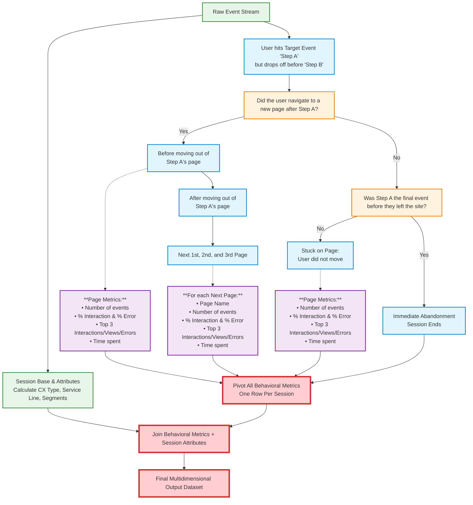

# Advanced Funnel Drop-off Analysis

## Overview
This skill provides a behavioral decision tree framework and SQL architecture to move beyond simple drop-off rates. It answers exactly *what* users do when they abandon a specific step in a funnel (the transition from a defined "Step A" to "Step B"), and joins that behavior with customer attributes.

## When to Use
- When asked to analyze drop-offs at a specific funnel bottleneck.
- When you need to know if users are getting stuck on a page vs. leaving the site.
- When you need to segment drop-off reasons by customer metadata (e.g., Logged-in vs Guest).

**OPTIONAL SUB-SKILL:** `funnel-conversion-analysis` can discover an unknown canonical happy-path between two natural-language points. Skip it when Step A and Step B are already known, concrete events (see Parameters below) — that is the common case for "why are users dropping off after X" questions, and the two reference queries in this skill run standalone.

## Parameters

The two executable queries below (`references/01_dropoff_summary_by_segment.sql` and
`references/02_dropoff_reason_breakdown.sql`) take four parameters. Fill them from the
question's wording using this domain mapping for the DTDL (Deutsche Telekom) tenant's
`silver_layer.t_link_journey_checkout_com` clickstream table:

| Param | Meaning | How to fill it |
| :--- | :--- | :--- |
| `$natco_code` | lowercase country/natco code | "DE" / "Germany" -> `de` |
| `$lookback_days` | integer days to look back from yesterday | "last 30 days" -> `30`; default to `30` if the question doesn't say |
| `$step_a_page` | exact `page_name` marking funnel entry (Step A) | "consent page" -> `checkout/consent` (verified: there is no separate alternate consent page — a `label='consent'` sub-step also exists, but every session that fires it also hits `page_name='checkout/consent'`, so the page is the correct, complete Step A) |
| `$step_b_action` | exact `action` marking funnel completion (Step B) | "order placement" / "order placed" / "purchase" / "checkout completion" -> `purchasesuccess` |

Both queries GROUP/aggregate server-side and `LIMIT 5` themselves, ordered so the most
important rows survive the skill engine's `.head(5)` preview truncation: query 1 orders
by absolute sessions dropped (biggest-impact segments first), query 2 by how many
dropped sessions showed each behavioral signal (most common reason first).

## The Behavioral Decision Tree

Use this framework to bucket user behavior after they hit Step A but fail to reach Step B.



## Executable Queries (what the skill engine actually runs)

For "why are users dropping off after Step A and not reaching Step B, broken down by
service_line and category" questions, the skill engine runs both reference queries
below, in order, substituting the parameters above:

1. **`references/01_dropoff_summary_by_segment.sql`** — sessions that reached Step A,
   how many of those reached Step B, and the drop-off rate, grouped by `service_line` x
   `category`, worst segments first.
2. **`references/02_dropoff_reason_breakdown.sql`** — for the dropped cohort only, what
   showed up on the Step A page itself (explicit errors, failed submissions, rejections,
   3-D Secure steps, or no error signal at all i.e. a passive exit), ranked by how many
   dropped sessions showed each signal.

Together these directly answer both halves of the question: *where* the drop-off
concentrates (query 1) and *what it looks like* (query 2) — without needing session-level
row output.

## Documented Pattern: Full Per-Session Behavioral Block Query (reference only, not wired for execution)

The framework below is a deeper 3-pillar SQL architecture (often via Athena/Presto window functions) that was hand-built for one specific Step A: the `checkout/account` login-or-registration sub-step:
1. **Pillar I:** Deduplicate and extract session attributes.
2. **Pillar II:** Isolate the drop-off cohort and build sequential "page blocks" using `LAG()` and `SUM() OVER`.
3. **Pillar III:** Pivot the blocks and join with the session attributes.

It produces one row per dropped session with the next-3-pages behavioral detail (interactions/views/errors/time spent) rather than an aggregated segment summary, and it hardcodes its Step A/B definitions and pulls extra columns from `eshop_data.es_events_v2` (a different table, registration-flow specific) — so it is **not** in `references/` and is not run by the skill engine. It is kept here as a worked example of the deeper behavioral-block pattern for when a future Step A genuinely needs next-page-level detail instead of an aggregated reason breakdown; adapting it to a new Step A means rewriting the hardcoded `page_name`/`action`/`label` literals throughout, not just changing a parameter.

```sql
WITH old_base AS (
    SELECT
        CAST(svc.event_date AS DATE) AS dt
      , svc.event_date
      , svc.session_id
      , svc.log_time
      , NULLIF(svc.user_id, '') AS user_id_clean
      , LOWER(svc.page_name) AS page_name
      , LOWER(svc.action) AS action
      , LOWER(svc.label) AS label
      , LOWER(svc.natco_code) AS natco_code
      , LOWER(svc.service_line) AS service_line
      , LOWER(svc.ui_page_category) AS ui_page_category
      , LOWER(svc.product_category) AS product_category
      , LOWER(svc.category) AS category
      , LOWER(svc.product_name) AS product_name
      , LOWER(svc.product_variant_name) AS product_variant_name
      , LOWER(svc.buying_option) AS buying_option
      , LOWER(svc.identifiers_customer_type) AS identifiers_customer_type
      , LOWER(svc.user_login_type) AS user_login_type
      , LOWER(svc.user_type) AS user_type
      , svc.order_id
      , LOWER(svc.business_group) AS business_group
      , LOWER(svc.product_name) AS item_name
      , LOWER(svc.contract_card_type) AS contract_card_type
    FROM silver_layer.t_link_journey_checkout_com AS svc
    WHERE LOWER(svc.natco_code) = 'de'
      AND CAST(svc.event_date AS DATE) BETWEEN CAST(date_add('day', -30, CURRENT_DATE) AS DATE)
                                           AND CAST(date_add('day', -1, CURRENT_DATE) AS DATE)
      AND LOWER(svc.is_internal_employee) = 'no'
      AND LOWER(svc.category) <> 'addonmanagement'
),
session_data_for_single_attributed_service_line AS (
    WITH session_and_service_level AS (
        SELECT
            b.session_id
          , CASE
                WHEN b.service_line = 'mobile' OR b.ui_page_category = 'mobile' THEN 'mobile'
                WHEN b.service_line = 'fixed'  OR b.ui_page_category = 'fixed'  THEN 'fixed'
                WHEN b.service_line = 'ott'    OR b.ui_page_category = 'ott'    THEN 'ott'
            END AS service_line
          , COUNT(*) AS event_count
          , MAX(b.log_time) AS latest_time
        FROM old_base b
        WHERE b.service_line IN ('mobile', 'fixed', 'ott')
           OR b.ui_page_category IN ('mobile', 'fixed', 'ott')
        GROUP BY b.session_id, 
            CASE 
                WHEN b.service_line = 'mobile' OR b.ui_page_category = 'mobile' THEN 'mobile'
                WHEN b.service_line = 'fixed'  OR b.ui_page_category = 'fixed'  THEN 'fixed'
                WHEN b.service_line = 'ott'    OR b.ui_page_category = 'ott'    THEN 'ott'
            END
    ),
    picking_service_line_at_session_level AS (
        SELECT *,
               ROW_NUMBER() OVER (PARTITION BY session_id ORDER BY event_count DESC, latest_time DESC) AS rn
        FROM session_and_service_level
    )
    SELECT b.*, psl.service_line AS revised_service_line
    FROM old_base b
    LEFT JOIN picking_service_line_at_session_level psl ON b.session_id = psl.session_id AND psl.rn = 1
    WHERE (b.service_line IN ('mobile', 'fixed', 'ott') OR b.ui_page_category IN ('mobile', 'fixed', 'ott'))
      AND (b.service_line = psl.service_line OR b.ui_page_category = psl.service_line)
),
session_data_for_single_attributed_service_line_and_category AS (
    WITH session_and_category_level AS (
        SELECT
            b.session_id
          , b.category
          , COUNT(*) AS event_count
          , MAX(b.log_time) AS latest_event
        FROM session_data_for_single_attributed_service_line b
        GROUP BY b.session_id, b.category
    ),
    picking_category_at_session_service_line_level AS (
        SELECT *,
               ROW_NUMBER() OVER (PARTITION BY session_id ORDER BY event_count DESC, latest_event DESC) AS rn
        FROM session_and_category_level
    )
    SELECT b.*, psl.category AS revised_category
    FROM session_data_for_single_attributed_service_line b
    LEFT JOIN picking_category_at_session_service_line_level psl ON b.session_id = psl.session_id AND psl.rn = 1
    WHERE b.category = psl.category
),
base AS (
    SELECT * FROM session_data_for_single_attributed_service_line_and_category
),
session_events AS (
    SELECT
        session_id
      , natco_code AS natco
      , MIN(dt) AS session_date
      , MIN(log_time) AS session_start_time
      , MAX(user_id_clean) AS user_id
      , MAX(order_id) AS order_id
      , MAX(CASE WHEN page_name = 'basket' AND action = 'pageview' THEN 1 ELSE 0 END) AS f_basket_view
      , MAX(CASE WHEN page_name LIKE '%checkout%' AND action = 'pageview' THEN 1 ELSE 0 END) AS f_checkout_view
      , MAX(CASE WHEN action IN ('checkout_initiated','onecheckoutinitiated') THEN 1 ELSE 0 END) AS f_checkout_initiated
      , MAX(CASE WHEN page_name = 'checkout/account' AND action IN ('pageview','checkoutstepviewed') THEN 1 ELSE 0 END) AS f_account_view
      , MAX(CASE WHEN page_name = 'checkout/account' AND action = 'checkoutstepsubmitted' AND label = 'account' THEN 1 ELSE 0 END) AS f_account_completed
      , MAX(CASE WHEN action = 'loginsuccess' THEN 1 ELSE 0 END) AS f_login_success
      , MAX(CASE WHEN page_name LIKE '%checkout/personalinfo%' AND action = 'pageview' THEN 1 ELSE 0 END) AS f_personalinfo_view
      , MAX(CASE WHEN page_name = 'checkout/personalinfo' AND action = 'clickinteractions' AND label = 'weiter' THEN 1 ELSE 0 END) AS f_personalinfo_continue
      , MAX(CASE WHEN page_name LIKE '%checkout/identification%' AND action = 'pageview' THEN 1 ELSE 0 END) AS f_ident_view
      , MAX(CASE WHEN page_name = 'checkout/identification' AND action = 'checkoutstepsubmitted' THEN 1 ELSE 0 END) AS f_ident_completed
      , MAX(CASE WHEN page_name LIKE '%checkout/appointment%' AND action = 'pageview' THEN 1 ELSE 0 END) AS f_appointment_view
      , MAX(CASE WHEN page_name = 'checkout/appointment' AND action = 'checkoutstepsubmitted' THEN 1 ELSE 0 END) AS f_appointment_completed
      , MAX(CASE WHEN page_name LIKE '%checkout/shipping%' AND action = 'pageview' THEN 1 ELSE 0 END) AS f_shipping_view
      , MAX(CASE WHEN page_name = 'checkout/shipping' AND action = 'checkoutstepsubmitted' THEN 1 ELSE 0 END) AS f_shipping_completed
      , MAX(CASE WHEN page_name LIKE '%checkout/payment%' AND action = 'pageview' THEN 1 ELSE 0 END) AS f_payment_view
      , MAX(CASE WHEN page_name LIKE '%consent%' AND action = 'pageview' THEN 1 ELSE 0 END) AS f_consent_view
      , MAX(CASE WHEN action = 'purchasesuccess' THEN 1 ELSE 0 END) AS f_order_placed
      , MAX(CASE WHEN page_name = 'checkout/account' AND action = 'checkoutsubstepviewed' AND label = 'login or registration' THEN 1 ELSE 0 END) AS f_account_choice_viewed
      , MAX(CASE WHEN page_name = 'checkout/account' AND action = 'radiobuttonclicks' AND label = 'register' THEN 1 ELSE 0 END) AS f_register_selected
      , MAX(CASE WHEN page_name = 'checkout/account' AND action = 'radiobuttonclicks' AND label = 'login' THEN 1 ELSE 0 END) AS f_login_selected
      , MAX(CASE WHEN page_name = 'checkout/account' AND action = 'clickinteractions' AND label = 'weiter' THEN 1 ELSE 0 END) AS f_weiter_clicked
      , MAX(CASE WHEN page_name = 'checkout/account' AND action = 'checkoutsubstepviewed' AND label = 'registration form' THEN 1 ELSE 0 END) AS f_registration_form_viewed
      , MAX(CASE WHEN page_name = 'checkout/account' AND action = 'checkoutsubstepsubmitted' AND label = 'registration form' THEN 1 ELSE 0 END) AS f_registration_form_completed
      , MAX(CASE WHEN page_name = 'checkout/account' AND action = 'checkoutsubstepviewed' AND label = 'registration verification code' THEN 1 ELSE 0 END) AS f_registration_verification_viewed
      , MAX(CASE WHEN page_name = 'checkout/account' AND action = 'checkoutsubstepsubmitted' AND label = 'registration verification code' THEN 1 ELSE 0 END) AS f_registration_verification_completed
      , MAX(CASE WHEN page_name = 'checkout/account' AND action = 'checkoutsubstepviewed' AND label = 'login - enter login identifier' THEN 1 ELSE 0 END) AS f_login_identifier_viewed
      , MAX(CASE WHEN page_name = 'checkout/account' AND action = 'checkoutsubstepsubmitted' AND label = 'login - enter login identifier' THEN 1 ELSE 0 END) AS f_login_identifier_completed
      , MAX(CASE WHEN page_name = 'checkout/account' AND action = 'checkoutsubstepviewed' AND label = 'login - enter password' THEN 1 ELSE 0 END) AS f_login_password_viewed
      , MAX(CASE WHEN page_name = 'checkout/account' AND action = 'checkoutsubstepsubmitted' AND label = 'login - enter password' THEN 1 ELSE 0 END) AS f_login_password_completed
      , MAX(CASE WHEN page_name = 'checkout/account' AND action = 'contentfillout' AND label = 'email' THEN 1 ELSE 0 END) AS f_content_email
      , MAX(CASE WHEN page_name = 'checkout/account' AND action = 'contentfillout' AND label = 'password' THEN 1 ELSE 0 END) AS f_content_password
      , MAX(CASE WHEN page_name = 'checkout/account' AND action = 'contentfillout' AND label = 'confirmpassword' THEN 1 ELSE 0 END) AS f_content_confirmpassword
      , MAX(CASE WHEN page_name = 'checkout/account' AND action = 'contentfillout' AND label = 'emailorphonenumberorusername' THEN 1 ELSE 0 END) AS f_content_identifier
      , MAX(CASE WHEN page_name = 'checkout/account' AND action = 'devicefingerprintinginitiated' THEN 1 ELSE 0 END) AS f_device_fp_initiated
      , MAX(CASE WHEN page_name = 'checkout/account' AND action = 'devicefingerprintingpassed' THEN 1 ELSE 0 END) AS f_device_fp_passed
      , MAX(CASE WHEN page_name = 'checkout/account' AND action = 'registrationsuccess' AND label = 'email_otp' THEN 1 ELSE 0 END) AS f_registrationsuccess
      , MAX(CASE WHEN page_name = 'checkout/account' AND action = 'loginsuccess' THEN 1 ELSE 0 END) AS f_account_loginsuccess
      , MAX(CASE WHEN (page_name = 'checkout/personalinfo' AND action = 'checkoutsubstepviewed' AND label = 'personal info form') OR (page_name = 'checkout/personalinfo' AND action = 'checkoutstepviewed' AND label = 'personalinfo') THEN 1 ELSE 0 END) AS personal_details_form_viewed
      , MAX(CASE WHEN action = 'contentfillout' AND page_name = 'checkout/personalinfo' AND label = 'firstname' THEN '5.greenfield' WHEN identifiers_customer_type LIKE '%brown%' THEN '4.brownfield' WHEN identifiers_customer_type LIKE '%green%' THEN '3.greenfield' WHEN user_id_clean IS NOT NULL THEN '2.user_id available' ELSE '1.user_id not available' END) AS cx_type_calc
      , MIN(CASE WHEN page_name LIKE '%checkout%' THEN log_time END) AS first_checkout_log_time
      , MIN(CASE WHEN action = 'loginsuccess' THEN log_time END) AS login_success_log_time
      , MIN(CASE WHEN user_login_type = 'loggedin' THEN log_time END) AS first_loggedin_log_time
      , MAX(LOWER(COALESCE(NULLIF(service_line, ''), NULLIF(ui_page_category, '')))) AS service_line
      , MAX(CASE WHEN UPPER(TRIM(business_group)) = 'TARIFF' THEN ' +Tarrif' ELSE '' END) AS has_tariff
      , MAX(CASE WHEN UPPER(TRIM(business_group)) = 'MOBILE_DEVICE' OR LOWER(TRIM(product_name)) LIKE '%router%' OR LOWER(TRIM(product_name)) LIKE '%speedport%' OR LOWER(TRIM(product_name)) LIKE '%extender%' OR LOWER(TRIM(product_name)) LIKE '%repeater%' OR LOWER(TRIM(product_name)) LIKE '%mesh%' THEN '+ Device' ELSE '' END) AS has_device
      , MAX(CASE WHEN UPPER(TRIM(business_group)) = 'TARIFF' AND (LOWER(TRIM(product_category)) LIKE '%tv%' OR LOWER(TRIM(product_category)) LIKE '%ott%') THEN '+ Ott' ELSE '' END) AS has_ott_plan
      , MAX(CASE WHEN product_name LIKE '%flex%' THEN '+ b.Prepaid' ELSE '+ a.Postpaid' END) AS has_mobile_prepaid
      , MAX(CASE WHEN product_name LIKE '%PlusKarte%' THEN '+ Plus Card' ELSE '' END) AS has_plus_card
      , MAX(CASE WHEN product_name LIKE '%young%' OR product_name LIKE '%kid%' OR product_name LIKE '%teen%' THEN '+ Young' ELSE '' END) AS has_young
      , MAX(CASE WHEN product_name LIKE '%mobil%' AND service_line = 'mobile' THEN '+b. mobil' WHEN service_line = 'mobile' THEN '+ a.non_mobile' ELSE '' END) AS has_mobile_connection
      , MAX(category) AS category
    FROM base b
    GROUP BY session_id, natco_code
),
session_funnel AS (
    SELECT *,
        CASE WHEN f_register_selected = 1 AND f_weiter_clicked = 1 THEN 1 ELSE 0 END AS f_registration_funnel_entered
      , CASE WHEN f_login_selected = 1 AND f_weiter_clicked = 1 THEN 1 ELSE 0 END AS f_login_funnel_entered
      , CASE WHEN f_register_selected = 1 AND f_weiter_clicked = 1 AND f_login_success = 1 THEN 1 ELSE 0 END AS f_registration_funnel_completed
      , CASE WHEN f_login_selected = 1 AND f_weiter_clicked = 1 AND f_login_success = 1 THEN 1 ELSE 0 END AS f_login_funnel_completed
    FROM session_events
),
checkout_start_login_type AS (
    SELECT session_id, user_login_type AS login_type_at_checkout_start
    FROM (
        SELECT session_id, user_login_type,
               ROW_NUMBER() OVER (PARTITION BY session_id ORDER BY log_time ASC) AS rn
        FROM base
        WHERE page_name LIKE '%checkout%' AND user_login_type IS NOT NULL AND user_login_type <> ''
    ) WHERE rn = 1
),
cx_flags_intd AS (
    SELECT *,
        CASE
            WHEN first_checkout_log_time IS NULL THEN
                CASE
                    WHEN login_success_log_time IS NULL AND first_loggedin_log_time IS NULL THEN 'no_login'
                    ELSE 'login_no_checkout'
                END
            WHEN first_loggedin_log_time IS NOT NULL AND first_loggedin_log_time <= first_checkout_log_time THEN 'pre_checkout'
            WHEN login_success_log_time IS NOT NULL AND login_success_log_time <= first_checkout_log_time THEN 'pre_checkout'
            WHEN first_loggedin_log_time IS NOT NULL THEN 'post_checkout'
            WHEN login_success_log_time IS NOT NULL THEN 'post_checkout'
            ELSE 'no_login'
        END AS login_timing
      , CASE
            WHEN cx_type_calc = '5.greenfield' THEN 'greenfield'
            WHEN cx_type_calc = '4.brownfield' THEN 'brownfield'
            WHEN cx_type_calc = '3.greenfield' THEN 'greenfield'
            WHEN cx_type_calc = '2.user_id available' THEN 'user_id available'
            WHEN cx_type_calc = '1.user_id not available' THEN 'user_id not available'
            ELSE cx_type_calc
        END AS cx_type
      , service_line || has_tariff || has_mobile_connection || has_mobile_prepaid || has_plus_card || has_young || has_device || has_ott_plan AS service_line_nuanced
    FROM session_funnel f
),
pi_view_ranked AS (
    SELECT session_id,
           ROW_NUMBER() OVER (PARTITION BY NULLIF(user_id, '') ORDER BY session_start_time ASC) AS nth_session_of_pi_view
    FROM cx_flags_intd
    WHERE personal_details_form_viewed = 1 AND NULLIF(user_id, '') IS NOT NULL
),
session_fact AS (
    SELECT f.*, r.nth_session_of_pi_view, c.login_type_at_checkout_start
    FROM cx_flags_intd f
    LEFT JOIN pi_view_ranked r ON f.session_id = r.session_id
    LEFT JOIN checkout_start_login_type c ON f.session_id = c.session_id
),
raw_event_flags AS (
    SELECT
        identifiers_sessionid AS session_id
      , MAX(CASE WHEN action = 'radioButtonClicks' AND label = 'register' AND attr_elementtitle = 'login or registration' AND identifiers_page_name = 'checkout/account' THEN 1 ELSE 0 END) AS reg_button_selection
      , MAX(CASE WHEN action = 'checkoutSubStepSubmitted' AND label = 'login or registration' AND attr_option_selected = 'register' AND identifiers_page_name = 'checkout/account' THEN 1 ELSE 0 END) AS reg_button_submission
      , MAX(CASE WHEN action = 'checkoutSubStepViewed' AND label = 'registration form' AND identifiers_page_name = 'checkout/account' THEN 1 ELSE 0 END) AS reg_form_viewed
      , MAX(CASE WHEN action = 'contentFillOut' AND attr_form_name = 'registration form' AND label = 'email' AND identifiers_page_name = 'checkout/account' THEN 1 ELSE 0 END) AS reg_email_enter
      , MAX(CASE WHEN action = 'contentFillOut' AND attr_form_name = 'registration form' AND label = 'password' AND identifiers_page_name = 'checkout/account' THEN 1 ELSE 0 END) AS reg_password_enter
      , MAX(CASE WHEN action = 'contentFillOut' AND attr_form_name = 'registration form' AND label = 'confirmPassword' AND identifiers_page_name = 'checkout/account' THEN 1 ELSE 0 END) AS reg_confirm_pwd_enter
      , MAX(CASE WHEN action = 'clickInteractions' AND label = 'Weiter' AND attr_elementtitle = 'registration form' AND identifiers_page_name = 'checkout/account' THEN 1 ELSE 0 END) AS reg_form_continue
      , MAX(CASE WHEN action = 'checkoutSubStepSubmitted' AND label = 'registration form' AND identifiers_page_name = 'checkout/account' THEN 1 ELSE 0 END) AS reg_form_submitted
      , MAX(CASE WHEN action = 'checkoutSubStepViewed' AND label = 'registration verification code' AND identifiers_page_name = 'checkout/account' THEN 1 ELSE 0 END) AS reg_code_viewed
      , MAX(CASE WHEN action = 'clickInteractions' AND label = 'Weiter' AND attr_elementtitle = 'registration verification code' AND identifiers_page_name = 'checkout/account' THEN 1 ELSE 0 END) AS reg_code_continue
      , MAX(CASE WHEN action = 'checkoutSubStepSubmitted' AND label = 'registration verification code' THEN 1 ELSE 0 END) AS reg_code_submitted
      , MAX(CASE WHEN action = 'checkoutSubStepSubmitted' AND label = 'login or registration' AND attr_option_selected = 'login' AND identifiers_page_name = 'checkout/account' THEN 1 ELSE 0 END) AS login_button_submission
      , MAX(CASE WHEN action = 'checkoutSubStepViewed' AND label = 'login - enter login identifier' AND identifiers_page_name = 'checkout/account' THEN 1 ELSE 0 END) AS login_identifier_viewed
      , MAX(CASE WHEN action = 'contentFillOut' AND attr_form_name = 'login - enter login identifier' AND label = 'emailOrPhoneNumberOrUsername' AND identifiers_page_name = 'checkout/account' THEN 1 ELSE 0 END) AS login_identifier_enter
      , MAX(CASE WHEN action = 'clickInteractions' AND label = 'Weiter' AND attr_elementtitle = 'login - enter login identifier' AND identifiers_page_name = 'checkout/account' THEN 1 ELSE 0 END) AS login_identifier_continue
      , MAX(CASE WHEN action = 'checkoutSubStepSubmitted' AND label = 'login - enter login identifier' AND identifiers_page_name = 'checkout/account' THEN 1 ELSE 0 END) AS login_identifier_submitted
      , MAX(CASE WHEN action = 'checkoutSubStepViewed' AND label IN ('login - enter password','login - enter sms code') AND identifiers_page_name = 'checkout/account' THEN 1 ELSE 0 END) AS login_password_viewed
      , MAX(CASE WHEN action = 'clickInteractions' AND label = 'Weiter' AND attr_elementtitle IN ('login - enter password','login - enter sms code') AND identifiers_page_name = 'checkout/account' THEN 1 ELSE 0 END) AS login_password_continue
      , MAX(CASE WHEN action = 'checkoutSubStepSubmitted' AND label IN ('login - enter password','login - enter sms code') THEN 1 ELSE 0 END) AS login_password_submitted
      , MAX(CASE WHEN action = 'loginSuccess' THEN 1 ELSE 0 END) AS login_success
      , MAX(CASE WHEN identifiers_page_name = 'checkout/identification' AND action = 'PageView' THEN 1 ELSE 0 END) AS id_page
      , MAX(CASE WHEN identifiers_page_name = 'checkout/identification' AND action = 'checkoutSubStepViewed' AND label = 'choose identification method' THEN 1 ELSE 0 END) AS id_choose_method
      , MAX(CASE WHEN identifiers_page_name = 'checkout/identification' AND action = 'clickInteractions' AND attr_elementvalue = 'Weiter' AND attr_elementtitle = 'choose identification method' THEN 1 ELSE 0 END) AS id_continue_step
      , MAX(CASE WHEN identifiers_page_name = 'checkout/identification' AND action = 'checkoutSubStepViewed' AND label = 'id verification form' THEN 1 ELSE 0 END) AS id_verification_form
      , MAX(CASE WHEN identifiers_page_name = 'checkout/identification' AND action = 'dropdownClicks' AND attr_elementtitle = 'document type' THEN 1 ELSE 0 END) AS id_document_type
      , MAX(CASE WHEN identifiers_page_name = 'checkout/identification' AND action = 'contentFillOut' AND label = 'publicAuthority' AND attr_form_name = 'id verification form' THEN 1 ELSE 0 END) AS id_public_authority
      , MAX(CASE WHEN identifiers_page_name = 'checkout/identification' AND action = 'contentFillOut' AND label = 'validityDate' AND attr_form_name = 'id verification form' THEN 1 ELSE 0 END) AS id_validity_date
      , MAX(CASE WHEN identifiers_page_name = 'checkout/identification' AND action = 'contentFillOut' AND label = 'idNumber' AND attr_form_name = 'id verification form' THEN 1 ELSE 0 END) AS id_number
      , MAX(CASE WHEN identifiers_page_name = 'checkout/identification' AND action = 'clickInteractions' AND attr_elementtitle = 'id verification form' AND attr_elementvalue = 'Weiter' THEN 1 ELSE 0 END) AS id_continue_form
      , MAX(CASE WHEN identifiers_page_name = 'checkout/identification' AND action = 'checkoutStepSubmitted' THEN 1 ELSE 0 END) AS id_step_submitted
    FROM eshop_data.es_events_v2
    WHERE nc = 'de'
      AND internalemployee = 'no'
      AND category = 'acquisition'
      AND identifiers_page_name LIKE '%checkout%'
      AND CAST(date AS DATE) BETWEEN CURRENT_DATE - INTERVAL '30' DAY AND CURRENT_DATE - INTERVAL '1' DAY
    GROUP BY identifiers_sessionid
),
-- Compile final attributes for the session
funnel_base AS (
    SELECT
        sf.*
      , COALESCE(ref.reg_button_selection, 0) AS reg_button_selection
      , COALESCE(ref.reg_button_submission, 0) AS reg_button_submission
      , COALESCE(ref.reg_form_viewed, 0) AS reg_form_viewed
      , COALESCE(ref.reg_email_enter, 0) AS reg_email_enter
      , COALESCE(ref.reg_password_enter, 0) AS reg_password_enter
      , COALESCE(ref.reg_confirm_pwd_enter, 0) AS reg_confirm_pwd_enter
      , COALESCE(ref.reg_form_continue, 0) AS reg_form_continue
      , COALESCE(ref.reg_form_submitted, 0) AS reg_form_submitted
      , COALESCE(ref.reg_code_viewed, 0) AS reg_code_viewed
      , COALESCE(ref.reg_code_continue, 0) AS reg_code_continue
      , COALESCE(ref.reg_code_submitted, 0) AS reg_code_submitted
      , COALESCE(ref.login_button_submission, 0) AS login_button_submission
      , COALESCE(ref.login_identifier_viewed, 0) AS login_identifier_viewed
      , COALESCE(ref.login_identifier_enter, 0) AS login_identifier_enter
      , COALESCE(ref.login_identifier_continue, 0) AS login_identifier_continue
      , COALESCE(ref.login_identifier_submitted, 0) AS login_identifier_submitted
      , COALESCE(ref.login_password_viewed, 0) AS login_password_viewed
      , COALESCE(ref.login_password_continue, 0) AS login_password_continue
      , COALESCE(ref.login_password_submitted, 0) AS login_password_submitted
      , COALESCE(ref.login_success, 0) AS login_success
      , COALESCE(ref.id_page, 0) AS id_page
      , COALESCE(ref.id_choose_method, 0) AS id_choose_method
      , COALESCE(ref.id_continue_step, 0) AS id_continue_step
      , COALESCE(ref.id_verification_form, 0) AS id_verification_form
      , COALESCE(ref.id_document_type, 0) AS id_document_type
      , COALESCE(ref.id_public_authority, 0) AS id_public_authority
      , COALESCE(ref.id_validity_date, 0) AS id_validity_date
      , COALESCE(ref.id_number, 0) AS id_number
      , COALESCE(ref.id_continue_form, 0) AS id_continue_form
      , COALESCE(ref.id_step_submitted, 0) AS id_step_submitted
      , CASE WHEN sf.f_register_selected = 1 OR sf.f_login_selected = 1 THEN 1 ELSE 0 END AS either_login_or_register_selected
    FROM session_fact sf
    LEFT JOIN raw_event_flags ref ON sf.session_id = ref.session_id
),
session_step_a AS (
    SELECT 
        session_id,
        MAX(log_time) AS max_step_a_time
    FROM silver_layer.t_link_journey_checkout_com
    WHERE LOWER(page_name) = 'checkout/account' 
      AND LOWER(action) = 'checkoutsubstepviewed' 
      AND LOWER(label) = 'login or registration'
    GROUP BY session_id
),
session_step_b AS (
    SELECT 
        session_id,
        MAX(1) AS has_step_b
    FROM silver_layer.t_link_journey_checkout_com
    WHERE 
		(
			LOWER(page_name) = 'checkout/account' 
		      AND LOWER(action) = 'radiobuttonclicks' 
		      AND LOWER(label) IN ('register', 'login')
		  )
	  or 
	  	(
		  LOWER(page_name) = 'checkout/account' 
		      AND LOWER(action) = 'checkoutsubstepsubmitted' 
		      AND LOWER(label) IN ('login or registration')
			)
    GROUP BY session_id
),
dropoff_cohort AS (
    SELECT a.session_id, a.max_step_a_time
    FROM session_step_a a
    LEFT JOIN session_step_b b ON a.session_id = b.session_id
    WHERE b.has_step_b IS NULL
),
post_step_a_events AS (
    SELECT 
        e.session_id,
        e.log_time,
        LOWER(e.page_name) AS page_name,
        LOWER(e.action) AS action,
        LOWER(e.label) AS label,
        CASE 
            WHEN LOWER(e.action) LIKE '%error%' OR LOWER(e.label) LIKE '%error%' OR LOWER(e.action) LIKE '%popup%' OR LOWER(e.label) LIKE '%popup%' THEN 'error'
            WHEN ( 
				LOWER(e.action) LIKE '%view%' 
              OR LOWER(e.action) IN (
                'popupappears',
                'devicefingerprintinginitiated',
                'magentaeinseligibilitycheck'
            ) )
			THEN 'view' 
            WHEN LOWER(e.action) IN (
			'loginsuccess',
			'devicefingerprintingpassed',
                'registrationsuccess',
                'purchasesuccess',
                'clickinteractions',
                'ctaclicks',
                'iconclicked',
                'radiobuttonclicks',
                'dropdownclicks',
                'contentfillout',
                'checkoutstepsubmitted',
                'checkoutsubstepsubmitted',
                'checkout_initiated',
                'onecheckoutinitiated'
            ) THEN 'interaction'
            ELSE 'interaction' 
        END AS event_type,
        COALESCE(e.action, '') || ' - ' || COALESCE(e.label, '') AS event_detail
    FROM dropoff_cohort c
    JOIN silver_layer.t_link_journey_checkout_com e 
      ON c.session_id = e.session_id 
     AND e.log_time > c.max_step_a_time
	 where LOWER(e.action) is not null
),
page_transitions AS (
    SELECT 
        *,
        CASE 
            WHEN has_moved_out = 0 THEN 0 
            WHEN has_moved_out = 1 AND COALESCE(LAG(has_moved_out) OVER (PARTITION BY session_id ORDER BY log_time ASC), 0) = 0 THEN 1 
            WHEN has_moved_out = 1 AND page_name != LAG(page_name) OVER (PARTITION BY session_id ORDER BY log_time ASC) THEN 1 
            ELSE 0 
        END AS is_new_framework_block
    FROM (
        SELECT 
            *,
            MAX(CASE WHEN page_name != 'checkout/account' THEN 1 ELSE 0 END) 
                OVER (PARTITION BY session_id ORDER BY log_time ASC ROWS BETWEEN UNBOUNDED PRECEDING AND CURRENT ROW) AS has_moved_out
        FROM post_step_a_events
    ) sub
),
framework_blocks AS (
    SELECT 
        *,
        SUM(is_new_framework_block) 
            OVER (PARTITION BY session_id ORDER BY log_time ASC ROWS BETWEEN UNBOUNDED PRECEDING AND CURRENT ROW) AS block_id
    FROM page_transitions
),
block_metrics AS (
    SELECT 
        session_id,
        block_id,
        MAX(page_name) AS page_name,
        COUNT(*) AS num_events,
        SUM(CASE WHEN event_type = 'interaction' THEN 1 ELSE 0 END) AS num_interaction_events,
        SUM(CASE WHEN event_type = 'view' THEN 1 ELSE 0 END) AS num_view_events,
        SUM(CASE WHEN event_type = 'error' THEN 1 ELSE 0 END) AS num_error_events,
        date_diff('second', from_unixtime(MIN(log_time) / 1000.0), from_unixtime(MAX(log_time) / 1000.0)) AS time_spent_seconds,
        
        MAX(CASE WHEN event_type = 'interaction' AND rn_type = 1 THEN event_detail END) AS interaction_1,
        MAX(CASE WHEN event_type = 'interaction' AND rn_type = 2 THEN event_detail END) AS interaction_2,
        MAX(CASE WHEN event_type = 'interaction' AND rn_type = 3 THEN event_detail END) AS interaction_3,
        MAX(CASE WHEN event_type = 'view' AND rn_type = 1 THEN event_detail END) AS view_1,
        MAX(CASE WHEN event_type = 'view' AND rn_type = 2 THEN event_detail END) AS view_2,
        MAX(CASE WHEN event_type = 'view' AND rn_type = 3 THEN event_detail END) AS view_3,
        MAX(CASE WHEN event_type = 'error' AND rn_type = 1 THEN event_detail END) AS error_1,
        MAX(CASE WHEN event_type = 'error' AND rn_type = 2 THEN event_detail END) AS error_2,
        MAX(CASE WHEN event_type = 'error' AND rn_type = 3 THEN event_detail END) AS error_3
    FROM (
        SELECT 
            *,
            ROW_NUMBER() OVER (PARTITION BY session_id, block_id, event_type ORDER BY log_time ASC) AS rn_type
        FROM framework_blocks
    ) sub2
    GROUP BY session_id, block_id
),
session_summary AS (
    SELECT 
        c.session_id,
        c.max_step_a_time,
        
        CASE WHEN MAX(b.block_id) >= 1 THEN 'Yes' ELSE 'No' END AS did_exist_page_post_step_a,
        CASE WHEN MAX(b.block_id) IS NULL THEN 'Yes' ELSE 'No' END AS is_step_a_last_event,
        
        MAX(CASE WHEN b.block_id = 0 THEN b.num_events ELSE 0 END) AS b0_num_events,
        MAX(CASE WHEN b.block_id = 0 THEN CAST(b.num_interaction_events AS DOUBLE) / NULLIF(b.num_events, 0) ELSE NULL END) AS b0_pct_interaction,
        MAX(CASE WHEN b.block_id = 0 THEN b.interaction_1 END) AS b0_interaction_1,
        MAX(CASE WHEN b.block_id = 0 THEN b.interaction_2 END) AS b0_interaction_2,
        MAX(CASE WHEN b.block_id = 0 THEN b.interaction_3 END) AS b0_interaction_3,
        MAX(CASE WHEN b.block_id = 0 THEN b.view_1 END) AS b0_view_1,
        MAX(CASE WHEN b.block_id = 0 THEN b.view_2 END) AS b0_view_2,
        MAX(CASE WHEN b.block_id = 0 THEN b.view_3 END) AS b0_view_3,
        MAX(CASE WHEN b.block_id = 0 THEN CAST(b.num_error_events AS DOUBLE) / NULLIF(b.num_events, 0) ELSE NULL END) AS b0_pct_error,
        MAX(CASE WHEN b.block_id = 0 THEN b.error_1 END) AS b0_error_1,
        MAX(CASE WHEN b.block_id = 0 THEN b.error_2 END) AS b0_error_2,
        MAX(CASE WHEN b.block_id = 0 THEN b.error_3 END) AS b0_error_3,
        MAX(CASE WHEN b.block_id = 0 THEN b.time_spent_seconds ELSE 0 END) AS b0_time_spent_seconds,

        MAX(CASE WHEN b.block_id = 1 THEN b.page_name END) AS b1_page_name,
        MAX(CASE WHEN b.block_id = 1 THEN b.num_events ELSE 0 END) AS b1_num_events,
        MAX(CASE WHEN b.block_id = 1 THEN CAST(b.num_interaction_events AS DOUBLE) / NULLIF(b.num_events, 0) ELSE NULL END) AS b1_pct_interaction,
        MAX(CASE WHEN b.block_id = 1 THEN b.interaction_1 END) AS b1_interaction_1,
        MAX(CASE WHEN b.block_id = 1 THEN b.interaction_2 END) AS b1_interaction_2,
        MAX(CASE WHEN b.block_id = 1 THEN b.interaction_3 END) AS b1_interaction_3,
        MAX(CASE WHEN b.block_id = 1 THEN b.view_1 END) AS b1_view_1,
        MAX(CASE WHEN b.block_id = 1 THEN b.view_2 END) AS b1_view_2,
        MAX(CASE WHEN b.block_id = 1 THEN b.view_3 END) AS b1_view_3,
        MAX(CASE WHEN b.block_id = 1 THEN CAST(b.num_error_events AS DOUBLE) / NULLIF(b.num_events, 0) ELSE NULL END) AS b1_pct_error,
        MAX(CASE WHEN b.block_id = 1 THEN b.error_1 END) AS b1_error_1,
        MAX(CASE WHEN b.block_id = 1 THEN b.error_2 END) AS b1_error_2,
        MAX(CASE WHEN b.block_id = 1 THEN b.error_3 END) AS b1_error_3,
        MAX(CASE WHEN b.block_id = 1 THEN b.time_spent_seconds ELSE 0 END) AS b1_time_spent_seconds,

        MAX(CASE WHEN b.block_id = 2 THEN b.page_name END) AS b2_page_name,
        MAX(CASE WHEN b.block_id = 2 THEN b.num_events ELSE 0 END) AS b2_num_events,
        MAX(CASE WHEN b.block_id = 2 THEN CAST(b.num_interaction_events AS DOUBLE) / NULLIF(b.num_events, 0) ELSE NULL END) AS b2_pct_interaction,
        MAX(CASE WHEN b.block_id = 2 THEN b.interaction_1 END) AS b2_interaction_1,
        MAX(CASE WHEN b.block_id = 2 THEN b.interaction_2 END) AS b2_interaction_2,
        MAX(CASE WHEN b.block_id = 2 THEN b.interaction_3 END) AS b2_interaction_3,
        MAX(CASE WHEN b.block_id = 2 THEN b.view_1 END) AS b2_view_1,
        MAX(CASE WHEN b.block_id = 2 THEN b.view_2 END) AS b2_view_2,
        MAX(CASE WHEN b.block_id = 2 THEN b.view_3 END) AS b2_view_3,
        MAX(CASE WHEN b.block_id = 2 THEN CAST(b.num_error_events AS DOUBLE) / NULLIF(b.num_events, 0) ELSE NULL END) AS b2_pct_error,
        MAX(CASE WHEN b.block_id = 2 THEN b.error_1 END) AS b2_error_1,
        MAX(CASE WHEN b.block_id = 2 THEN b.error_2 END) AS b2_error_2,
        MAX(CASE WHEN b.block_id = 2 THEN b.error_3 END) AS b2_error_3,
        MAX(CASE WHEN b.block_id = 2 THEN b.time_spent_seconds ELSE 0 END) AS b2_time_spent_seconds,

        MAX(CASE WHEN b.block_id = 3 THEN b.page_name END) AS b3_page_name,
        MAX(CASE WHEN b.block_id = 3 THEN b.num_events ELSE 0 END) AS b3_num_events,
        MAX(CASE WHEN b.block_id = 3 THEN CAST(b.num_interaction_events AS DOUBLE) / NULLIF(b.num_events, 0) ELSE NULL END) AS b3_pct_interaction,
        MAX(CASE WHEN b.block_id = 3 THEN b.interaction_1 END) AS b3_interaction_1,
        MAX(CASE WHEN b.block_id = 3 THEN b.interaction_2 END) AS b3_interaction_2,
        MAX(CASE WHEN b.block_id = 3 THEN b.interaction_3 END) AS b3_interaction_3,
        MAX(CASE WHEN b.block_id = 3 THEN b.view_1 END) AS b3_view_1,
        MAX(CASE WHEN b.block_id = 3 THEN b.view_2 END) AS b3_view_2,
        MAX(CASE WHEN b.block_id = 3 THEN b.view_3 END) AS b3_view_3,
        MAX(CASE WHEN b.block_id = 3 THEN CAST(b.num_error_events AS DOUBLE) / NULLIF(b.num_events, 0) ELSE NULL END) AS b3_pct_error,
        MAX(CASE WHEN b.block_id = 3 THEN b.error_1 END) AS b3_error_1,
        MAX(CASE WHEN b.block_id = 3 THEN b.error_2 END) AS b3_error_2,
        MAX(CASE WHEN b.block_id = 3 THEN b.error_3 END) AS b3_error_3,
        MAX(CASE WHEN b.block_id = 3 THEN b.time_spent_seconds ELSE 0 END) AS b3_time_spent_seconds
    FROM dropoff_cohort c
    LEFT JOIN block_metrics b ON c.session_id = b.session_id
    GROUP BY c.session_id, c.max_step_a_time
)
SELECT 
    -- 1. Drop-off Analysis Fields
    d.session_id,
    d.did_exist_page_post_step_a,
    d.is_step_a_last_event,
    
    d.b0_num_events AS current_page_num_events,
    d.b0_pct_interaction AS current_page_pct_interaction,
    d.b0_time_spent_seconds AS current_page_time_spent_seconds,
    d.b0_interaction_1 AS current_page_interaction_1,
    d.b0_interaction_2 AS current_page_interaction_2,
    d.b0_interaction_3 AS current_page_interaction_3,
    d.b0_view_1 AS current_page_view_1,
    d.b0_view_2 AS current_page_view_2,
    d.b0_view_3 AS current_page_view_3,
    d.b0_pct_error AS current_page_pct_error,
    d.b0_error_1 AS current_page_error_1,
    d.b0_error_2 AS current_page_error_2,
    d.b0_error_3 AS current_page_error_3,

    d.b1_page_name AS next_page_1_name,
    d.b1_num_events AS next_page_1_num_events,
    d.b1_pct_interaction AS next_page_1_pct_interaction,
    d.b1_time_spent_seconds AS next_page_1_time_spent_seconds,
    d.b1_interaction_1 AS next_page_1_interaction_1,
    d.b1_interaction_2 AS next_page_1_interaction_2,
    d.b1_interaction_3 AS next_page_1_interaction_3,
    d.b1_view_1 AS next_page_1_view_1,
    d.b1_view_2 AS next_page_1_view_2,
    d.b1_view_3 AS next_page_1_view_3,
    d.b1_pct_error AS next_page_1_pct_error,
    d.b1_error_1 AS next_page_1_error_1,
    d.b1_error_2 AS next_page_1_error_2,
    d.b1_error_3 AS next_page_1_error_3,

    d.b2_page_name AS next_page_2_name,
    d.b2_num_events AS next_page_2_num_events,
    d.b2_pct_interaction AS next_page_2_pct_interaction,
    d.b2_time_spent_seconds AS next_page_2_time_spent_seconds,
    d.b2_interaction_1 AS next_page_2_interaction_1,
    d.b2_interaction_2 AS next_page_2_interaction_2,
    d.b2_interaction_3 AS next_page_2_interaction_3,
    d.b2_view_1 AS next_page_2_view_1,
    d.b2_view_2 AS next_page_2_view_2,
    d.b2_view_3 AS next_page_2_view_3,
    d.b2_pct_error AS next_page_2_pct_error,
    d.b2_error_1 AS next_page_2_error_1,
    d.b2_error_2 AS next_page_2_error_2,
    d.b2_error_3 AS next_page_2_error_3,

    d.b3_page_name AS next_page_3_name,
    d.b3_num_events AS next_page_3_num_events,
    d.b3_pct_interaction AS next_page_3_pct_interaction,
    d.b3_time_spent_seconds AS next_page_3_time_spent_seconds,
    d.b3_interaction_1 AS next_page_3_interaction_1,
    d.b3_interaction_2 AS next_page_3_interaction_2,
    d.b3_interaction_3 AS next_page_3_interaction_3,
    d.b3_view_1 AS next_page_3_view_1,
    d.b3_view_2 AS next_page_3_view_2,
    d.b3_view_3 AS next_page_3_view_3,
    d.b3_pct_error AS next_page_3_pct_error,
    d.b3_error_1 AS next_page_3_error_1,
    d.b3_error_2 AS next_page_3_error_2,
    d.b3_error_3 AS next_page_3_error_3,

    -- 2. Funnel Attributes to Slice By
    f.service_line,
    f.service_line_nuanced,
    f.category,
    f.cx_type,
    f.login_timing,
    f.login_type_at_checkout_start,
    f.has_tariff,
    f.has_device,
    f.has_ott_plan,
    f.has_mobile_prepaid,
    f.has_plus_card,
    f.has_young,
    f.has_mobile_connection,
    f.natco
FROM session_summary d
INNER JOIN funnel_base f ON d.session_id = f.session_id;
```
