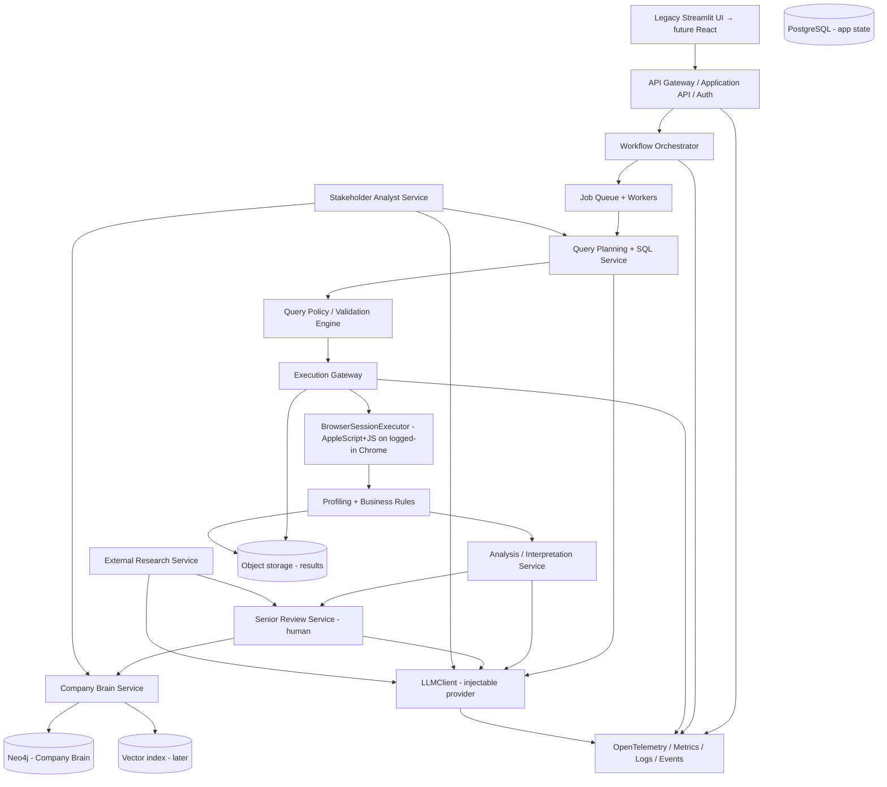
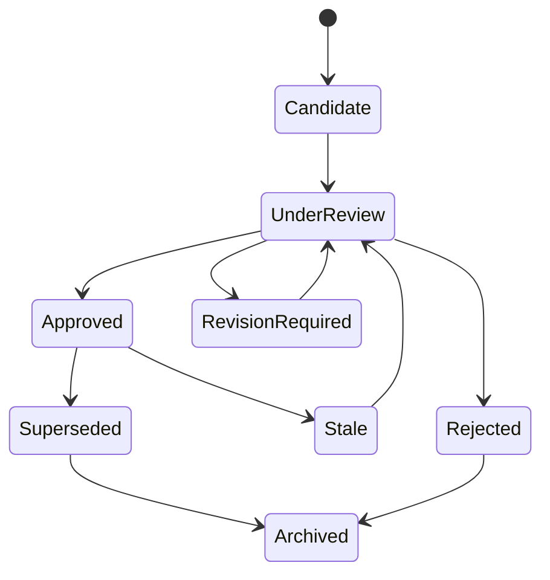

# STANDALONE_ANALYTICS_PLATFORM_PLAN

**Prepared:** 2026-08-07 · **Status:** Approved implementation plan — **in execution; core complete as of 2026-08-08 (see [Plan Status & Progress](#plan-status--progress-living-spine))** · **Target:** standalone, company-independent AI analytics copilot with future commercial potential

> Source of truth for the current system: `Handoff Document — Autonomous AI Analytics Copilot` (c2bba8d1-c1c5-4e88-b36c-08ce5c26aafb).
> North-star goal and clarification history captured from the prior work session. All "current state" claims verified against the codebase on 2026-08-07.

---

## Plan Status & Progress (living spine)

> **This section is the spine of the repo — keep it updated as work lands.** Last updated: 2026-08-08 · HEAD `5a26cfe` **CP-15** (`main`).

**Overall:** implementation **in progress — core complete**. Phases **P0–P9 are DONE (core)**; the platform ships as a supervised analytics copilot. CP-11 (config panel + junior depth + MD renderings) and **CP-12 (live junior)** landed; **CP-13 is the LLM bill guard** (process-wide TTL cache + persisted daily LLM budget + UI cache); **CP-14 drained the senior review queue** (approved+rejected leave the inbox, the junior never re-asks, review-backlog gate). **CP-15 makes the junior two-tier, driven by promotion/demotion** (`junior_depth`, the existing `⬆/⬇` on the senior tab): below depth 2 the junior roams a broad **low-level exploratory taxonomy** (schema, fill rates, success trends, breakdown/funnel-by-dimension, univariate contribution) that **auto-folds to governed FINDINGs** under a per-tenant cap (never cluttering the human inbox); at **depth 2 the junior unlocks high-level hypothesis formation / RCA**, which is **human-governed** and may spawn **on-the-spot low-level supporting probes** that are **exempt from the 1/hr + 3/day caps** and written as a **separate workpaper** attached to the high-level review. Remaining work = operator/security tail (live OIDC/SSO, per-tenant browser profiles, threat model/pen-test/DR/SOC2) + deeper junior Stage-4/5 autonomy. Everything below is committed.

### Completed stages (vs. §11 Delivery Roadmap)

| Stage | Status | What is in place (repo) |
|---|---|---|
| **P0 — Stabilize & measure** | ✅ DONE | git repo, reference copy frozen (`AI analytics/` untouched), Neo4j snapshot exported (`extracted_data/knowledge_graph_snapshot.json`), offline E2E harness (`scratch/test_copilot_e2e.py`), trace/span events |
| **P1 — Extract core from Streamlit** | ✅ DONE | typed domain models (`domain.py`), `LLMClient` wrapping the static gateway, run state machine, FastAPI (`api.py`), Streamlit = thin API client (`standalone_ui.py`) |
| **P2 — Browser-session executor + policy** | ✅ DONE | `QueryExecutor` interface, hardened `BrowserSessionExecutor` (injectable runner, offline-tested), sqlglot read-only policy, offline duckdb sampler; **live Metabase E2E confirmed (3/3)** |
| **P3 — Company-independent onboarding** | ✅ DONE | `OnboardingService`, tenant + company profile, data sources, guided wizard + **version history** |
| **P4 — Company Brain v2** | ✅ DONE (core) | `brain/store.py` (lifecycle CANDIDATE→…→APPROVED/REJECTED/STALE, multi-dimension confidence, conflicts, isolation), `brain/ingest.py` (AST ingestion), migration from the Neo4j snapshot (CP1–CP3). Vector retrieval deferred |
| **P5 — Junior + senior workflows** | ✅ DONE (core) | `JuniorEngine` (maturity stages, EDA catalog, goal-aligned questions, LLM hook), `TriageService` review inbox, **`SeniorService` approve/reject/revise → promote to governed FINDING (CP-10)**; **CP-11 adds human-controlled junior question-depth (promote/downgrade → deeper questions + hypotheses), the first-N-days human-signoff mandate, and per-analysis markdown renderings** |
| **P6 — Stakeholder analyst** | ✅ DONE (core) | `StakeholderService`: classify → approved-knowledge-first → refresh/cite → escalate → feedback + quality |
| **P7 — External research** | ✅ DONE (core) | `ResearchService`: allow/block sources, credibility, citations, EXTERNAL nodes start **CANDIDATE** (senior gate). Live provider connections deferred |
| **P8 — Commercial hardening** | ✅ DONE (core) | `auth.py` (signed tokens, RBAC, OIDC seam; **off by default**), `billing.py`, `retention.py`. Live OIDC/SSO + per-tenant browser profiles + security tail deferred |
| **P9 — Owner observability + background junior** | ✅ DONE (core) | `api_logs` + HTTP access-log middleware (30-day retention), weekly auto-purge `Scheduler`, background `JuniorWorker` (10:00–19:00 window, 1/hr, serial single-flight), `/observability/*`, UI **Observability** tab |
| **Brain migration + triage** | ✅ DONE | migrated tenant triaged to completion: **APPROVED 536 / REJECTED 693 / 0 CANDIDATEs** (CP-X1–X10) |

**Test status:** 196/196 standalone tests pass (all `tests/` modules except legacy `test_ui_and_db`, which hangs only because it targets an unreachable Neo4j). Live Metabase tests: 3/3; live DT funnel drive: 3/3 junior analyses (conversion, error-rate, funnel volumes) with MD review files.

### Built beyond the plan (additions)

| Addition | Where | Notes |
|---|---|---|
| **Background autonomous `JuniorWorker` + `Scheduler`** | `analytics_platform/junior_worker.py`, `scheduler.py` | System-time window, one problem/hr, serial single-flight lock, persisted purge state — concrete automation beyond the plan's described autonomy |
| **API access-log middleware + retention/purge** | `api.py`, `database.py`, `scheduler.py` | 30-day `api_logs` retention with weekly auto-purge (never logs credentials) |
| **Analyst AI config panel** | `domain.py` (`AnalystAI`/`AnalystConfig`), `tenancy.py`, `senior.py` | Per-analyst junior/senior/stakeholder toggles + provider/model, versioned per tenant (`analyst_configs` + `analyst_config_history`) |
| **Config panel API + UI (CP-11)** | `api.py` (`/tenants/{tid}/analyst-config`, `/llm/models`), `ui_client.py`, `standalone_ui.py` **Config tab** | GET/PUT config + versioned history in the UI; live provider-model ping (OpenRouter `/models`, Ollama `/api/tags`); shared default key/model from `Settings`/env, keys never stored |
| **Junior question-depth control (CP-11)** | `domain.py` (`junior_depth`), `junior.py`, `senior.py`, UI Triage/Config tabs | Human promote/downgrade (0 basic → 2 advanced); depth scales questions + adds business hypotheses (`/junior/{tid}/hypotheses`); depth persisted + versioned with config |
| **Human-signoff mandate (CP-11)** | `config.py` (`junior_human_signoff_days`), `senior.py` | First N days (default 7) every junior analysis requires explicit human review; an AI senior cannot auto-approve in the window or at basic depth |
| **Per-analysis markdown renderings (CP-11)** | `analytics_platform/markdown.py`, `api.py` `/analyses/{tid}/{rid}/md` | Every analysis renders as a reviewable `.md` (question/SQL/facts/hypotheses); persisted under `data/reviews/<tenant>/<run_id>.md`, surfaced in the Triage tab |
| **Worker enable-gate (CP-11)** | `junior_worker.py` | `junior.enabled=false` fully stops the background junior (no runaway ask/solve) regardless of window/rate |
| **Persisted 1/hr + 3/day caps (CP-12)** | `config.py` (`junior_daily_cap`), `junior_worker.py` (`_daily_key`/`_runs_today`/`_record_ran`) | Per-tenant hourly (`junior_last:*`) + per-UTC-day (`junior_daily:*:<date>`) counters in `scheduler_state` — survive app/session restarts; `daily_cap` reason + `daily_ok` surfaced |
| **On-demand junior trigger + live roll-out (CP-12)** | `api.py` `POST /tenants/{tid}/junior/run`, `ui_client.py`, `standalone_ui.py` | Self-picked reproducible approved funnel query → live read-only Metabase → full analysis + MD; `force` relaxes window/rate for tests only; scheduler runs while live (`ANALYTICS_WATCHER=1`) |
| **LLM analysis adapter fix (CP-12)** | `llm/client.py` | `GatewayClient` now maps `ollama_url`/`timeout` to the real gateway signature — previously every live call raised, silently suppressing all LLM insight/hypothesis enrichment |
| **Reproducible-query selection (CP-12)** | `junior_worker.py`, `brain/store.py` (`usable_queries`), `junior.py` | `approved_queries` now scans the full Brain in SQL (newest-first), and the worker picks template/brace-free approved queries it hasn't just answered — no stale/`{{tag}}`/JSON-escape SQL hits Metabase |
| **LLM bill guard (CP-13)** | `junior.py` (`_LLM_ENRICH_CACHE`, `_llm_budget_*`), `config.py` (`junior_llm_cache_ttl_minutes`, `llm_daily_cap`), `standalone_ui.py` (`@st.cache_data`) | Process-wide TTL cache (60 min) for LLM-enriched questions/hypotheses so UI reruns/schedulers fire **at most one OpenRouter generation per tenant per TTL**; persisted per-UTC-day budget (`llm_daily:*:<date>`, default 20) is the hard stop; UI caches junior reads so checkbox/button ticks cost nothing |
| **Draining senior review (CP-14)** | `senior.py` (`queue`), `junior_worker.py` (`pick_problem_statement`, `_answered_questions`, `_pending_review_count`), `config.py` (`junior_review_backlog_max`), `standalone_ui.py` | Approved **and** rejected analyses leave the senior inbox (approved → governed FINDING in the Brain; rejected → recorded declined); the junior **never re-asks an answered question** (consulting `analysis_runs`); and a **review-backlog gate** (default 3) pauses generation while humans are backed up, so the inbox cannot grow unbounded (`force` bypass for tests) |
| **Two-tier junior by promotion/demotion (CP-15)** | `junior.py` (`suggest_questions`, `_low_level_pool`, `_lo`), `junior_worker.py` (`pick_problem_statement`, `_save_run`, `_maybe_autopromote`, `_run_supporting`), `domain.py` (`level`/`category`/`supportive_of`), `markdown.py` (workpaper), `config.py` (`junior_autopromote_cap`, `junior_supporting_cap`), `senior.py`, `standalone_ui.py` | Below depth 2 the junior roams a **low-level taxonomy** (schema/fill-rate/success-trend/breakdown/funnel-by-dim/uni-variate contribution) that **auto-folds to approved FINDINGs** under `junior_autopromote_cap` (never in the inbox; schema probes & anomalies never fold); at **depth 2 high-level (hypothesis/RCA) unlocks**, is **human-governed** (inbox), and may spawn ≤ `junior_supporting_cap` **on-the-spot low-level supporting probes** that are **exempt from the 1/hr + 3/day caps**, `supportive_of=<high run>`, and rendered as a **separate `…_workpapers.md`** (not an independent review item). `SeniorService.queue` + backlog gate are scoped to human-reviewable runs only |
| **Senior review inbox at run level → governed FINDING** | `senior.py`, `pipeline.promote_finding` | `analysis_runs.review_status` lifecycle; the human plays senior when the senior AI is off (**human-on-top**) |
| **Triage Conflicts dedupe (keep-one)** | `api.py` `POST /triage/{tid}/dedupe`, UI | reject (actionable) + supersede (approved) per conflict group |
| **Definitions review tab** | `standalone_ui.py` | Grouped value-set review showing source SQL before approve/reject |
| **Company-profile version history** | `tenancy.py`, `api.py` | Business-context snapshots versioned over time |
| **Standalone UI 8-tab thin client** | `standalone_ui.py`, `ui_client.py` | Business / Junior / Triage / Stakeholder / Research / Governance / Observability / **Config** |
| **One-click launcher** | `run_dashboard.command` | Starts the backend (if needed) + opens the standalone UI; retired the legacy `app.py` boot |

### Material deviations from the plan

- **SQLite (`data/migration.db`) instead of PostgreSQL** for app state + the Company Brain — single storage seam, swap-ready.
- **Company Brain v2 persisted in SQLite tables** (Neo4j semantics: stable IDs, tenant, status, version, source_ref, confidence dims), not Neo4j. Neo4j remains only for the legacy `core.*` prototype; the exported snapshot is the migration baseline into the platform.
- **No object storage / job queue / worker pool yet** — results + jobs live in SQLite; jobs run in-process (`Scheduler`/`JuniorWorker`).
- **React/Next frontend deferred** — the Streamlit thin client is the shipped UI (plan §5.2 explicitly allows this).
- **Auth ships off by default** (`ANALYTICS_AUTH_ENABLED=1` to enable) — intentional for the pilot.

### Backlog (next up)

1. **P8 operator tail** — live OIDC/SSO provider + per-tenant browser profiles.
2. **P7 provider connections** — wire approved external search providers.
3. **Security tail** — threat model / pen test / DR / SOC2 readiness.
4. **Junior Stage 4–5** — external/competitive research autonomy + governed proactive investigations.
5. **Vector retrieval** for unstructured notes (plan §8).
6. **Junior depth → mastery badges** — automatic depth promotion once a senior-approval threshold is met (human still holds the override).

---

## 1. Executive Summary

Two findings drive this plan:

1. **The existing app is a healthy, working prototype** — natural-language → SQL generated against a Neo4j knowledge brain (Hebbian weights, golden queries, column business definitions), SQL self-healing, business-anomaly auto-correction, and a 4-tab analyst hub. Everything described in the handoff was verified present and passing (syntax + module smoke tests). **Do not scrap it.**

2. **Metabase is reachable only through the open browser's human-authenticated session** — today via AppleScript injecting JavaScript into the active, already-logged-in Chrome tab (`core/table_fetcher.py`), acting on the cookie that lives in that session. The user confirmed **this access model is permanent**. **It stays** as a first-class, human-in-the-loop *execution connector* — it is not something to rip out.

**Recommendation: controlled re-platforming, not a rewrite.** Keep the analytical engine and Company Brain knowledge; rebuild the portability / tenancy / governance / workflow / observability *shell* around it incrementally, with a rollback path at every step. Preserve the current app as a working reference and regression oracle.

---

## 2. Goal & Product Vision

### 2.1 North-star goal

A standalone, secure, **database-tool-independent** analytics platform that, given any company:

- **Initializes** from minimal inputs: the names of some main tables, a set of **legacy queries** previously written to analyze the business, and an **"About the company"** briefing (what the business does, who its customers are, what the product is, how it creates value, how it makes money, and its strategic target — growth maximization, margin, funnel optimization, risk mitigation, constraints, etc.).
- Runs a **curious junior analyst** which, in stages, asks questions, writes queries, **runs them on whatever the company's database is**, analyzes the data, and submits findings to a senior analyst:
  - Stage A — **Exploratory**: what data exists, EDA over tables, schema understanding, ballpark numbers, framing an opinion about the data points available.
  - Stage B — **Business learning**: reads the senior-accepted analyses; once the brain is deemed to understand tables/schema/business metrics/ballparks/trends, moves to **goal-aligned** hypothesis generation about company processes, trends, and improvement opportunities.
  - Stage C — **External/competitive**: researches the web for best practices and case studies (similar companies / other domains with similar targets), forming externally informed hypotheses.
- A **senior analyst** validates the junior's work — SQL logic, business sense, soundness of analysis — and when satisfied, **stores the question, the query, the analysis, and the business understanding in a graph network** (the *Company Brain*), connect-ing the question asked → how it was answered → findings → how the finding can be used.
- A **low-cost stakeholder analyst** answers any ad-hoc question a business stakeholder asks, using the Company Brain.
- Exposes **platform-health and usage metrics** to the owner, with every internal interaction observable **as if components talked over APIs** so API health and "which APIs fired" can be monitored.

### 2.2 Non-negotiables

- **Humans stay in the loop for *decisions*** (approval of knowledge, novel/high-risk answers, metric definitions) — not for *running queries*.
- **Read-only on the customer database** — only `SELECT` / metadata / approved `EXPLAIN`.
- **Authentication is human-in-the-loop by design** — the open-browser/cookie session. No credential scraping, no MFA bypass.
- **The Company Brain is correctable and governed** — approved knowledge is distinct from generated content; nothing generated silently becomes company fact.

### 2.3 Non-goals for the first commercial version

Replace senior analysts entirely · execute production data changes · make autonomous business decisions · train foundation models from scratch · support every database dialect on day one · unrestricted web research · send complete customer datasets to third-party LLMs · treat LLM confidence as proof of correctness.

---
## 3. Current-State Inventory (verified 2026-08-07)

| File | Role | Verdict |
|---|---|---|
| `app.py` (~110 kB) | Streamlit UI + orchestration + auto-trigger + anomaly auto-correct block + 4-tab analyst hub | **Extract logic**; keep as `streamlit_legacy` UI |
| `core/query_generator.py` | 2-phase SQL generation (Blueprint + Execution); column business defs injected top-of-prompt | **Reuse** → `query_planning` |
| `core/graph_learner.py` (610 ln) | Neo4j read/write, Hebbian weights, golden queries, `get_column_business_definitions()` | **Split** → `catalog` / `company_brain` |
| `core/auto_healer.py` (312 ln) | SQL diagnosis + LLM-guided healing; `feedback_type` param | **Reuse** → `query_planning/healing` |
| `core/reasoning/analyst.py` (189 ln) | Senior product analyst briefing + `get_critical_anomalies()` (static-safe) | **Split** → `analysis` / `review` |
| `core/local_analytics/router.py` | DuckDB conversational drill-down (static-safe LLMGateway) | **Reuse** → `stakeholder_analyst` |
| `core/profiler/fast_summary.py` (156 ln) | Instant statistical profile | **Reuse** → `profiling` |
| `core/rules/engine.py` (222 ln) | Business rules (100% conversion, negative metrics, etc.) | **Reuse** → `rules` |
| `core/exploration/visualizer.py` (26 ln) | PyGWalker interactive HTML | **Reuse** → frontend adapter |
| `core/llm_gateway.py` (400 ln) | Static-only LLM gateway (OpenRouter / Gemini / Ollama) | **Wrap** behind `LLMClient` interface |
| `core/metabase_executor.py`, `core/table_fetcher.py`, `scratch/metabase_ui_automation.py` | **AppleScript → JS injection into the authenticated Chrome tab** on the open browser session/cookie | **Keep & formalize** → `browser_session_executor` |
| `core/parser.py`, `core/schema_validator.py` | SQL-ish parsing + agentic schema validation | **Reuse**, upgrade to `sqlglot` AST |
| `core/neo4j_adapter.py`, `core/db.py`, `core/pipeline.py`, `core/analysis.py`, `core/eda_engine.py` | Supporting infra | Reuse/migrate as needed |

### 3.1 Capabilities worth preserving (with upgrade notes)

- **Two-phase SQL planning** → formalize as a query-planning service (produce a *plan* before SQL).
- **Neo4j schema & query retrieval, ranked by Hebbian weight** → keep weights as one *ranking* signal only.
- **Golden-query ingestion** → add lineage, owner, versioning, approval status.
- **Column business definitions** (`get_column_business_definitions`) → replace regex-only extraction with SQL AST where possible; keep the "definitions injected before schema" invariant.
- **Runtime auto-healing** (`feedback_type=...`) → keep behind safety policies; today only `BUSINESS_LOGIC` is exercised.
- **Business anomaly detection** → separate deterministic rules from LLM interpretation.
- **Fast result profiling, product-analyst briefing, DuckDB drill-down, PyGWalker** → all reusable.
- **LLM gateway** → redesign as an injectable `LLMClient` interface.
- **Anomaly auto-correction loop** (15 s countdown, ⚡/✕, per-version `briefing_cache_key`, rerun) → keep as the seed of the "auto-heal within policy" flow.

### 3.2 Gaps found during verification

- No plan file previously existed on disk (it lived only in chat).
- `feedback_type` today only has the `BUSINESS_LOGIC` path; no `RUNTIME_ERROR` / `USER_CORRECTION` tokens in code.
- Several handoff "open items" are unbuilt: `confidence_score` on `get_critical_anomalies()`, persistence of `BusinessCorrectionRule` to Neo4j, shareable PyGWalker URL, streaming analyst output, and the offline E2E harness `scratch/test_copilot_e2e.py` (missing — only `test_agentic_loop_e2e.py` exists).
- This folder is **not a git repo** — Version control should be added as part of P0.

---

## 4. Key Decisions

| # | Decision | Rationale |
|---|---|---|
| 1 | **Scrap? No.** Controlled re-platforming; preserve the current app as a reference / regression oracle. | The analytical engine and Brain are working and valuable; a rewrite wastes it. |
| 2 | **Human in the loop? Yes.** Senior analyst approves knowledge; business owner validates profile/metrics; data admin approves access; authentication requires a human's logged-in browser. | Matches the north star; safe for commercial use. |
| 3 | **Metabase access = open-browser cookie, permanently.** Do **not** replace the browser path — **harden and isolate it** as the default `BrowserSessionExecutor`; allow other executors later without touching the core. | User-stated permanent constraint. |
| 4 | **Isolation:** each company = a tenant; schema, graph, credentials, logs, embeddings fully isolated. | Required for multi-company / commercial use. |
| 5 | **Execution:** modular monolith first; API-ready boundaries; extract services only when security/scale demands. | Avoid premature microservices. |
| 6 | **Observability paranoia:** every operation tagged with tenant + trace + stage, and every component emits an event/span → the owner can answer "what fired, did it work, what did it cost" as if everything were an API. | Explicit user requirement for owner metrics. |
| 7 | **The LLM is not the query authority.** SQL AST validation, policy engine, schemas, tests, and execution results are the deterministic controls. | Prevents plausible-but-wrong SQL. |
| 8 | **Approval status is a hard gate;** confidence scores only *rank* retrieval. | Prevents weights from being mistaken for truth. |
| 9 | **Test through the API; every front-end control is wired to an API endpoint.** Every behaviour ships with an API-contract test (registered route + request model → service → persisted state). Streamlit is a thin API client that never touches the DB/services directly; each interactive control maps to an `ui_client` method backed by a covered route, and is verified to change server state (or surface a visible error). | Guarantees the UI actually works when clicked and catches regressions at the contract boundary. |

---
## 5. Target Architecture



### 5.1 Execution Gateway — the "internals talk over APIs" requirement

Internal components can stay **in-process typed functions** in the modular monolith, but every executor implements **one interface**, so the analytics core never knows execution is a browser session, a Metabase API, or a direct connection:

```python
class SessionStatus:
    state: str          # "valid" | "expired" | "needs_login" | "unknown"
    tenant_id: str
    browser_ok: bool
    last_checked_at: str

class QueryExecutor(Protocol):
    def session_status(self, tenant_id: str) -> SessionStatus: ...
    def execute(self, sql: str, ctx: ExecutionContext) -> QueryResult: ...
    def cancel(self, execution_id: str) -> bool: ...

class BrowserSessionExecutor:
    """v1 default. AppleScript -> JS injection into the authenticated Chrome tab."""

class MetabaseAPIExecutor: ...   # optional, future
class DirectDBExecutor: ...       # optional, future
```

`BrowserSessionExecutor` (your current AppleScript + JS path) is the v1 implementation. Any later executor is a drop-in behind the same `Proxy`. **This is what satisfies "which APIs fired and their health"**: every `execute` / `cancel` / `session_status` emits an **OpenTelemetry span + domain event** (`{tenant, trace, stage, status, duration, bytes}`), even in-process, so the owner's dashboard shows the full pipeline as if each hop were a monitored API.

### 5.2 Initial deployment recommendation

- **Backend:** FastAPI (modular monolith) + worker processes.
- **App DB:** PostgreSQL (questions, runs, versions, jobs, users).
- **Graph:** Neo4j (Company Brain).
- **Object storage:** S3-compatible (large/raw results).
- **Jobs:** Temporal (or Celery + Redis for an early prototype).
- **SQL parsing/validation:** `sqlglot`.
- **Local result analysis:** DuckDB (already used).
- **Observability:** OpenTelemetry → Prometheus/Grafana + structured logs + event stream.
- **Secrets:** secret manager / Vault, customer-controlled where required.
- **Frontend (later):** React/Next.js; until then, Streamlit as a thin API client.

### 5.3 Repo restructuring (target) + current→target mapping

```text
analytics-platform/
├── apps/{api,worker,web,streamlit_legacy}
├── packages/{domain,company_profile,catalog,connectors,query_planning,
│            query_policy,execution,profiling,rules,analysis,review,
│            company_brain,stakeholder_analyst,research,llm,observability,security}
├── migrations/{postgres,neo4j}
├── tests/{unit,integration,contract,dialect,security,end_to_end}
├── fixtures/{schemas,golden_queries,synthetic_companies}
├── infrastructure/  docs/  pyproject.toml
```

| Current | Target |
|---|---|
| `app.py` | `apps/streamlit_legacy/` (thin UI) |
| `core/query_generator.py` | `packages/query_planning/` |
| `core/graph_learner.py` | `packages/catalog/` + `packages/company_brain/` |
| `core/auto_healer.py` | `packages/query_planning/healing/` |
| `core/reasoning/analyst.py` | `packages/analysis/` + `packages/review/` |
| `core/local_analytics/router.py` | `packages/stakeholder_analyst/` |
| `core/profiler/fast_summary.py` | `packages/profiling/` |
| `core/rules/engine.py` | `packages/rules/` |
| `core/exploration/visualizer.py` | frontend visualization adapter |
| `core/llm_gateway.py` | `packages/llm/` (interfaces + providers) |
| `core/table_fetcher.py`, `core/metabase_executor.py` | `packages/execution/browser_session_executor/` |
| `core/parser.py`, `core/schema_validator.py` | `packages/query_planning/` (sqlglot-backed) |

### 5.4 Testing contract (required)

The **public HTTP API is the only integration seam**; the Streamlit UI is a thin API client.

1. **Test through the API.** Every feature/behaviour ships with an **API-contract test** that goes through the registered FastAPI routes with the real request models and asserts the **persisted server-state change** — not just a return value. When starlette `TestClient`/`httpx` is unavailable, invoke the registered route handlers directly (the exact closures the framework calls, as `tests/test_api.py` does) so path/method wiring, tenant gating (404), request parsing, and endpoint→service→state are all exercised.
2. **Service-layer unit tests are supplementary, never a substitute** for the API test. They stay for fast/precise coverage, but correctness at the contract boundary is what ships.
3. **Every interactive front-end element is wired to an API endpoint.** `standalone_ui.py` must call `ui_client` (API client) methods only — never the `Store`, services, or DB directly. Each control maps to a `ui_client` method that maps to a route covered by an API test.
4. **No silent no-ops.** Mutating controls must change server state; failures surface visibly (guarded, `st.error`, or an explicit count). A control whose action would be entirely skipped by the governance gate (e.g. reject-on-`APPROVED`) must either be disabled or visibly explain *why*, so a user never sees "nothing happened."
5. **Definition of done for any feature/tab:** (a) API-contract test asserting state change; (b) an `ui_client` method; (c) a UI element that calls that method; (d) a UI-connectivity check (every `_client().<method>` used in the UI exists on `APIClient` and its route is registered and mutates state).

---
## 6. Company Initialization Workflow (the "we're told about the company" flow)

1. **Tenant + security boundary** — company identity, region/data-residency, allowed LLM providers, retention, roles, sensitive-data policy, audit requirements. *Exit: tenant resources + encryption keys provisioned.*
2. **Company profile (guided)** — what the company does, customers, customer problems, value delivery, revenue model, strategic targets (**structured**, not prose: name, priority, owner, time horizon, target value, metric references, constraints, last-reviewed), constraints, risks, seasonality, competitors, preferred metrics, terminology. *Exit: business owner approves the profile.*
3. **Connect data source** — read-only credentials / open-browser session for Metabase; test connectivity; select allowed schemas; timeouts + query limits; verify cancellation; record dialect + data-residency. *Exit: safe sample query + metadata scan succeed.*
4. **Seed main tables** — the user names core fact/dimension/event/revenue/customer/product/operational tables; the catalog expands outward via discovered relations + query history. *Exit: initial table map approved.*
5. **Ingest legacy queries & analyses** — SQL files, Metabase cards, dashboard queries, dEVt models, notebooks, CSV+descriptions, metric docs. Parse via SQL AST; detect tables/columns/filters/joins/CTEs/aggregations; identify dialect; tie to owner+source; mark **unverified** until reviewed; extract candidate metric/definition nodes; execute only with permission. *Exit: representative queries reviewed + classified.*
6. **Build the initial semantic layer** — candidate definitions for entities, metrics, dimensions, events, funnel stages, status values, time grains, cohort rules, join paths. Resolve conflicts rather than averaging. *Exit: critical metrics have approved definition + test query.*
7. **Baseline data profiling** — on approved datasets only: row counts, date coverage, null rates, uniqueness, value distributions, potential identifiers, outliers, update frequency, schema drift, potential sensitive data. *Exit: data owners acknowledge known quality issues.*
8. **Company Brain readiness review** — senior analyst reviews table coverage, join confidence, metric coverage, legacy-query coverage, data-quality issues, ballparks, trend baselines, unresolved conflicts; assigns an initial **maturity stage**. *Exit: Brain assigned a maturity level.*

---

## 7. Junior Analyst Maturity Stages (gated by the senior analyst)

| Stage | Scope | Promotion gate (set by senior) |
|---|---|---|
| **0 — Onboarding** | Metadata inspection, safe row-counts, date ranges, null/uniqueness profiling, legacy-query interpretation. | Main tables mapped; critical columns identified; basic joins reviewed; no critical security violations. |
| **1 — Data discovery** | Table grain, date coverage, entities/events, data-quality concerns, ballpark values. | Approved schema map; reviewed table grains; validated high-value joins; baseline DQ report; recorded ballparks. |
| **2 — Metric understanding** | Reconstruct accepted metrics; compare-generation vs. legacy; learn definitions; detect conflicts. | Critical metrics approved; metric test cases pass; legacy outputs reproduced within tolerance; senior accepts metric map. |
| **3 — Internal process / opportunity** | Trends, bottlenecks, goal-aligned hypotheses, follow-up investigations. | Min accepted-analyses; healthy SQL review pass rate; acceptable unsupported-claim rate; useful novel findings; no unresolved critical concerns. |
| **4 — External / competitive** | Research best practices + case studies (similar/adjacent domains); denote internally vs. externally sourced. | Brain mature enough; research cited; internal/external facts separated; every competitive conclusion senior-approved. |
| **5 — Governed proactive** | Scheduled investigations, material-change detection, priority suggestions, refresh accepted analyses, route high-value work to review. | Stays within budget/cost/review policy at all times; all conclusions governed. |

The junior's day-0 loop: **asks questions → writes queries → runs them (BrowserSessionExecutor) → analyzes the data → submits to senior**. The senior **approves / revises / rejects** and promotes accepted `question → query → finding → use-case` into the Company Brain.

## 8. The Company Brain & Confidence Model

### 8.1 Anatomy

A versioned graph of: companies, products, customer segments, objectives, processes, business entities, data sources, tables, columns, join paths, metrics, dimensions, queries, analyses, findings, hypotheses, decisions, recommendations, business rules, data-quality issues, competitors, external sources, review records, people/owners.

Every important node carries: **stable ID · tenant · status · version · created/updated · created-by · reviewed-by · source type + source ref · confidence dimensions · freshness/expiry policy · sensitivity classification.**

### 8.2 Confidence = multiple dimensions, not one weight

Replace the single Hebbian edge weight with independent dimensions:

- **Evidence confidence** — directly supported by query results?
- **Review confidence** — approved by an authorized reviewer?
- **Definition confidence** — metrics/joins approved?
- **Freshness confidence** — is it current?
- **Reproducibility confidence** — can it be reproduced?
- **Data-quality confidence** — source datasets reliable?
- **External-source confidence** — public sources credible/current?

Optional composite ranking score: `C = w_eE + w_rR + w_dD + w_fF + w_pP + w_qQ`, weights sum to 1. Composite **ranks** retrieval only; **approval status remains a hard filter**.

### 8.3 Knowledge lifecycle



### 8.4 Migration of existing Neo4j knowledge

Golden queries + column business definitions migrate in **with provenance** (owner, source card/question, extraction method, review state). Hebbian weights are preserved as a legacy ranking input but no longer the source of truth. The existing knowledge graph snapshot (`extracted_data/knowledge_graph_snapshot.json`) is a migration baseline.

---
## 9. Metric / Observability Layer (owner-facing)

Every metric is per-tenant where relevant, plus platform-aggregate for the owner. Latency percentiles: p50 / p95 / p99.

### 9.1 Reliability
API availability · API error rate · API latency by endpoint · job completion rate · job queue age · executor (connector) success rate · query timeout rate · cancellation success rate · connector health by type · LLM provider error rate · knowledge-graph query latency.

### 9.2 Browser / Metabase executor (new — because the platform *depends* on the open browser cookie)
Session valid/expired state · `needs_login` events · human re-authentication wait time · page-load latency · query-submit success · result-extraction success · Selenium/JS timeout rate · **wrong-page / unexpected-redirect events** · reconnect attempts · **jobs blocked awaiting login** · execution duration · browser crash rate. These are the metrics that make "is the browser connector healthy" answerable.

### 9.3 SQL quality
First-pass SQL execution rate · auto-heal success rate · mean repair attempts · schema error rate · dialect error rate · policy-rejection rate · senior SQL approval rate · golden-query reproduction rate · join-correction rate · metric-definition-correction rate.

### 9.4 Analysis quality
Analysis approval rate · approved-without-revision rate · unsupported-claim (hallucination) rate · finding reproducibility rate · critical-anomaly precision · critical-anomaly recall · reviewer-disagreement rate · caveat completeness · evidence-link coverage · recommendation-acceptance rate.

### 9.5 Company Brain
Approved metric coverage · approved join coverage · table-understanding coverage · knowledge freshness · conflict count · orphan-node rate · reuse rate · stale knowledge rate · stage-progression time · review-backed knowledge ratio.

### 9.6 Stakeholder experience
Question→answer latency · answer-acceptance rate · clarification rate · escalation rate · repeated-question reuse rate · user-correction rate · citation-open rate · export/share rate · active users by role · questions per active stakeholder.

### 9.7 Cost (by tenant, workflow, model, connector)
LLM input/output tokens · LLM cost · DB execution time · warehouse credits / bytes scanned · object storage · graph ops · worker runtime · cost per question · cost per approved analysis · **cost per accepted answer** (`= total answer-generation cost / accepted answers`) · **senior time saved** (`= baseline − observed review time`).

### 9.8 Safety & governance
Sensitive-data-policy violations · blocked non-read-only queries · cross-tenant access attempts · unauthorized table access · audit-log completeness · credential-rotation compliance · retention-deletion compliance · result-export volume · citation coverage · high-risk answers produced without review · prompt-injection events · security incidents by severity.

### 9.9 Agent performance (per agent)
| Agent | Key metrics |
|---|---|
| Junior analyst | accepted analyses, first-pass approval, useful-hypothesis rate, cost per accepted analysis |
| Senior reviewer | agreement with human reviewer, false-approval rate, false-rejection rate |
| Stakeholder analyst | answer acceptance, reuse rate, escalation rate, latency, cost |
| SQL healer | success rate, regression rate, attempts, incremental cost |
| Research agent | citation coverage, credible-source rate, reviewer acceptance |

### 9.10 How "internals talk over APIs" is satisfied without premature services
Every component call emits an **event + OpenTelemetry span** with `{tenant, trace id, stage, actor, resource, status, duration, token/bytes used, policy outcome}`. A `/metrics` surface (and platform admin UI) shows the full pipeline (question → planning → policy → execution → analysis → review → brain → answer) as if each hop were a monitored API. This is a deliberate design decision: API-shaped observability *now*, service extraction only later when security/scale demands it. **Never log**: database passwords, cookies/session tokens, full access tokens, unredacted sensitive rows, or complete prompts containing sensitive data (unless explicitly permitted).

---

## 10. Security & Commercial Readiness

- **Read-only** DB accounts only.
- **Encryption** in transit and at rest; per-tenant keys where feasible.
- **Secrets manager**; short-lived credentials where possible.
- **RBAC + SSO** (SAML/OIDC); roles: platform owner, tenant admin, data admin, senior analyst, junior/discovery agent (governed read-only), stakeholder, auditor, service account.
- **Dataset / table / optional column-level** allowlists; sensitive-data classification; row-limit and export controls.
- **Query** timeouts, cancellation, and tenant-aware aggregate rate limiting.
- **Immutable audit log**, configurable retention, backup/restore, incident runbook.
- **Browser executor security** (critical): a **dedicated browser profile per tenant**; verify the active Metabase host + account *before* every run; detect login-page redirects and pause (never silently proceed against a logged-out session); **never** copy cookies into logs/graph/DB, send them to an LLM, or share a profile between tenants; capture screenshots only when needed, with retention controls.
- **LLM data controls**: remove credentials, avoid raw rows unless required, mask sensitive values, prefer schema/statistics/bounded samples, record provider/model + data-handling policy per call. Supported modes: approved external provider · customer-managed endpoint · private-cloud deployment · local model · metadata-only.
- **Deployment models** (commercial): multi-tenant SaaS · single-tenant managed · **customer-VPC with a customer-hosted browser-session agent** (cookie never leaves the customer machine — the natural fit for the open-browser constraint) · hybrid · self-hosted.

---
## 11. Delivery Roadmap (each phase ends with an exit criterion)

- **P0 — Stabilize & measure (≈2 wk) — ✅ DONE.** Freeze a reference copy; add git (this folder has none); regression fixtures + **`scratch/test_copilot_e2e.py`** (offline, no Metabase); export the Neo4j knowledge graph snapshot; document Streamlit / browser-session / Athena-cookie couplings; verify anomaly auto-correction + `get_column_business_definitions()`; add trace IDs. *Exit: ≥10 representative workflows reproducible; module-reuse scorecard approved.*
- **P1 — Extract core from Streamlit (≈3–4 wk) — ✅ DONE.** Typed request/response models; strip Streamlit from core; introduce `LLMClient` wrapping the static gateway; query-run state model; question/runs/versions persisted to PostgreSQL; Streamlit becomes a thin API client. *Exit: one question processed with no Streamlit import anywhere in the pipeline; LLM providers swappable via config; regressions still pass.*
- **P2 — Formalize the browser-session executor + policy engine (≈4–6 wk) — ✅ DONE.** Define `QueryExecutor`; implement hardened `BrowserSessionExecutor` (session/detected-login guard → `needs_login` pause/resume, per-tenant browser profile, redirect guards, timeouts, result caps, no cookie logging); add `sqlglot` AST validation; deterministic read-only / cost / row-limit / required-date-filter policy. *Exit: E2E execution decoupled from `app.py` internals; policy-rejected SQL never reaches the browser; expiry pauses cleanly.*
- **P3 — Company-independent onboarding (≈4–6 wk) — ✅ DONE.** Tenant + company profile models; guided questionnaire; data-source setup; schema discovery; legacy ingestion via AST; candidate metric/join extraction + approval workflow. *Exit: a second synthetic company onboards with zero code changes; terminology lives in config/knowledge, not prompts.*
- **P4 — Company Brain v2 (≈5–7 wk) — ✅ DONE (core).** Ontology + stable IDs; provenance + review records; lifecycle statuses; versioning + supersession; conflict & freshness; migrate Neo4j knowledge; optional vector retrieval for unstructured notes. *Exit: every approved finding links to evidence + review; stale/conflicting knowledge is visible; retrieval can restrict to approved knowledge.*
- **P5 — Junior + senior analyst workflows (≈5–7 wk) — ✅ DONE (core).** Maturity stages; exploration budgets + allowed query types; review rubrics; revision/resubmission loops; stage-promotion controls; proactive question generation aligned to objectives; reviewer-agreement evaluation. *Exit: junior stays within stage; senior can approve/reject/revise/promote/advance; transitions audited; novel hypotheses clearly separated from facts.*
- **P6 — Stakeholder analyst (≈4–6 wk) — ✅ DONE (core).** Question classification; retrieve approved knowledge first; refresh/adapt accepted queries; low-cost model routing; citations + caveats; escalation rules; feedback collection; answer-quality evaluation. *Exit: repeated questions reuse approved knowledge; high-risk items escalate; answers carry evidence + freshness; cost per answer tracked.*
- **P7 — External research (≈3–5 wk) — ✅ DONE (core).** Approved search providers; source storage + citations; allow/block lists; source-credibility classification; competitor/best-practice workflows. *Exit: external claims cited; internal vs. external distinguished; research can never silently promote to company fact.*
- **P8 — Commercial hardening (≈6–10 wk) — ✅ DONE (core).** SSO + enterprise RBAC; customer-VPC browser-session agent; billing/usage metering; retention + deletion; threat model + pen test; DR; SOC2 readiness path. *Exit: cross-tenant isolation passes; per-tenant usage/cost attributable; customer data deletable per policy.*

- **P9 — Owner-facing observability + background junior worker (added; not in the original P0–P8 roadmap) — ✅ DONE (core).** HTTP access-log middleware on `api_logs` (30-day retention), weekly auto-purge `Scheduler` (persisted due-state), autonomous background `JuniorWorker` (system-time window 10:00–19:00, one problem statement/hour, serial single-flight lock), `/observability/{status,logs,purge,junior/run}` routes + UI **Observability** tab. *Exit: the owner can answer "what fired, did it work, what did it cost" and the junior advances while the human is away.*
- **CP-10 — Senior-analyst tool (added).** Per-analyst AI config (junior/senior/stakeholder toggles + provider/model, versioned per tenant) + a run-level senior review inbox (`approve`/`reject`/`revise` → promote to a governed FINDING via `pipeline.promote_finding`); the human plays the senior role through the same surface when the senior AI is off (**human-on-top**). — ✅ DONE.

## 12. MVP Definition & Pilot Acceptance

**MVP includes:** tenant creation · company profile · 1–2 connectors (browser-session first) · schema discovery · legacy SQL ingestion · approved metric/join definitions · NL question → plan → policy → execute → profile · senior review → Brain promotion · stakeholder answers · full audit trail · core usage/reliability/quality/cost metrics.

**MVP excludes:** near-fully autonomous competitor research · every DB type · fully autonomous stage progression · advanced billing · microservice decomposition · custom model training.

**Pilot success means:** a new company onboarded with **no source-code changes**; ≥1 non-original dialect works E2E; critical metrics have approved definitions; historical analyses reproduced reliably; every answer traceable; unsafe SQL blocked pre-execution; senior can review/correct; approved knowledge reused in later answers; tenant-level cost/health visible; no cross-tenant or credential leak; measurable reduction in analyst execution time.

**Tentative pilot quality targets (goals, not guarantees):** first-pass SQL ≥ 80% · approved-without-revision ≥ 60% (bounded questions) · evidence-link coverage 100% (factual findings) · read-only blocking 100% · cross-tenant isolation 100% · escalation of all designated high-risk categories · complete audit events for the query/review lifecycle.

## 13. Major Risks & Mitigations

| Risk | Impact | Mitigation |
|---|---|---|
| Plausible-but-wrong SQL | High | `sqlglot` AST + golden tests + metric definitions + senior review |
| LLM invents explanations | High | Facts vs. hypotheses separation; evidence links required |
| Sensitive data reaches an LLM | High | Masking, provider policy, customer-hosted options, metadata-first prompts |
| Runaway query cost / warehouse | High | Budgets, EXPLAIN, required date filters, scan limits, cancellation |
| Brain accumulates bad knowledge | High | Lifecycle + provenance + expiry + supersession |
| Conflicting metric definitions | High | Explicit conflict resolution with owner control |
| **Browser executor frailty / Metabase UI drift** | **High** | **Session/redirect guards, `needs_login` pause/resume, per-tenant profiles, timeout/cap, fail-with-pause (not fail-silent)** |
| Premature microservices | Medium | Modular monolith with clean interfaces |
| Senior review bottleneck | Medium | Risk-based review + reuse of approved work |
| Overconfident low-cost analyst | High | Answer modes, confidence dimensions, escalation |
| Poor research sources | Medium | Citations, source policy, senior gate |
| Tenant prompts reintroduce coupling | Medium | Structured profiles/config-driven behaviour |
| Weights mistaken for truth | High | Approval status as hard gate; confidence only ranks |

## 14. Immediate 30-Day Action Plan

> **Status: executed / superseded by implementation** — Phases P0–P9 core are complete (see [Plan Status & Progress](#plan-status--progress-living-spine)). Retained below for historical reference.

- **Week 1:** freeze a reference copy; `git init`; export the Neo4j graph; regression fixtures + `scratch/test_copilot_e2e.py`; document Streamlit, browser-session, and Athena/cookie couplings; verify anomaly auto-correction + column-definition extraction; add structured logs + trace IDs.
- **Week 2:** module-reuse scorecard; core domain models; query-run state machine; `QueryExecutor` interface; Company Brain ontology draft; approve the re-platforming decision.
- **Week 3:** FastAPI app + auth; question submission + run tracking behind API; PostgreSQL persistence; wrap `LLMGateway` behind `LLMClient`; move one workflow out of `app.py`.
- **Week 4:** first connector (browser-session hardening); schema discovery via AST; read-only policy enforcement; one E2E question with **no Streamlit orchestration and no manual browser interaction beyond the already-open logged-in tab**; expose API / executor / LLM metric surfaces.

**30-day success condition:** one representative question flows *API → Brain retrieval → planning → SQL → policy → browser-session execution → profiling → interpretation → persisted run*, with validity checks, decoupled from Streamlit orchestration and requiring only the human-authenticated browser tab (not a login automation).

## 15. Final Recommendation

**Retain the analytical engine + Company Brain knowledge. Rebuild the portability / governance / observability shell.** Treat the open-browser/cookie Metabase access as a **first-class, human-in-the-loop `BrowserSessionExecutor`** — harden and isolate it rather than remove it, and let its session/health metrics drive reliability. Add tenants, an AST-driven policy engine, explicit junior/senior/stakeholder workflows, a governed Brain with provenance + versioning, and API-shaped observability before scaling autonomy. Autonomy grows **only** as measured SQL quality, review outcomes, Brain maturity, and safety justify it — so the product ships as a highly capable **supervised** analytics platform first, with carefully gated autonomy later.

> **Guarantees to preserve:** humans in the loop for *decisions* (not query-running); read-only on the customer DB; authentication via the open logged-in browser (never auto-login or cookie exfiltration).